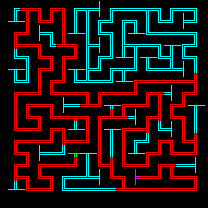

# Overview
Welcome to my Kotlin maze generator. I created this project as a learning experience
to learn depth first traversal and the kotlin language.

This maze generator uses depth first traversal to walk through the maze grid until it
reaches a point where it has visited all nearby cells. It will then backtrack using
a stack until it finds a new valid path, until all cells have been visited. The cell
walls will be removed as they are visited, thereby creating a maze.

The maze will save the longest path through the maze and use that to define start
and end points in the maze. The maze start in drawn in green and the maze end in
magenta. The other maze cells will be drawn in blue. The maze solution is
shown in red.

These cells are drawn to a buffered image and then saved to a .png image.
maze.png contains the maze itself and mazesolution.png contains the maze
showing the solution.

Maze | Solution
:-------------------------:|:-------------------------:
|

# Video Documentation 
[Maze Generator]()

[Algorithm Video(Old)](https://youtu.be/kncwkPHuK7Q)

# Development Environment
This project was developed in IntelliJ Idea using the kotlin plugin.

Draws on Java Abstract Window Toolkit (AWT) for rendering images.

# Useful Websites
* [Kotlin Documentation](https://kotlinlang.org/docs/home.html)
* [Wikipedia Maze Algorithms](https://en.wikipedia.org/wiki/Maze_generation_algorithm)

# Future Work
* ~~Add start and end points to maze.~~
* ~~Save maze to an image file.~~
* Add graphical UI.